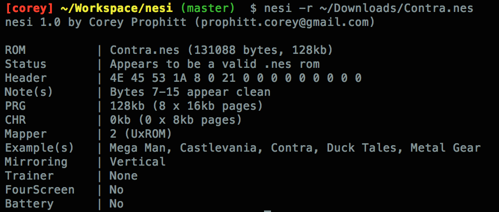

nesi
====

A rom hacking tool for the analysis of *.nes* rom images.

Requirements
------------

1. `Python 2.7` or `Python 3.0+` should suffice

Installation
------------

Work in progress...

Usage
-----

Nesi is a command line application. The basic usage can be found below:

    usage: nesi [-h] [-r ROM] [-v]

    Specify a .nes rom image to be analyzed

    optional arguments:
      -h, --help         show this help message and exit
      -r ROM, --rom ROM  path to a .nes rom image to be analyzed
      -v, --version      show the current nesi version

License
-------

    A rom hacking tool for the analysis of .nes rom images.
    Copyright (C) 2015, Corey Prophitt.

    This program is free software: you can redistribute it and/or modify
    it under the terms of the GNU General Public License as published by
    the Free Software Foundation, either version 3 of the License, or
    (at your option) any later version.

    This program is distributed in the hope that it will be useful,
    but WITHOUT ANY WARRANTY; without even the implied warranty of
    MERCHANTABILITY or FITNESS FOR A PARTICULAR PURPOSE.  See the
    GNU General Public License for more details.

    You should have received a copy of the GNU General Public License
    along with this program.  If not, see <http://www.gnu.org/licenses/>.

